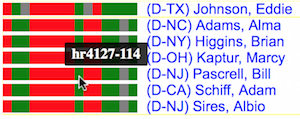

# US Congress Voting Pattern Visualizer for Taiwan-related Bills
This project visualizes the voting patterns of the US congress for Taiwan-related bills.
The goal is to provide people who are interested in US-Taiwan relationship
with a quick overview of how each congress member voted for bills having keywords
'Taiwan' and/or 'China'. 

<h4><a href="https://dwhuang.github.io/uscva/v1/index.html" target="_blank">Take me to the visualizer now >>></a></h4>

## A Quick Introduction

In the above screenshot, each congress member is mapped to a cell based on 
his/her voting history for Taiwan-related bills. The mapping is done such that
proximity reflects similarity in voting patterns. As a result, congress members
who are mapped to nearby cells have generally similar voting history.
The background colors indicate parties:
red for Republicant, blue for Democrats, and green for other parties. 
A number marked in a cell indicates that multiple congress members are mapped
to the same cell, due to identical or very similar voting history. 

To see who are mapped in a cell, as well as some details about
their voting history, simply mouseover the cell. Voting history is visualized as
a color bar (see the picture above),
where green indicates that the congress member voted 'yes' to a bill,
red indicates a 'no' vote, gray indicates a present vote, and white indicates
no data, mostly likely due to ineligibility to vote.

To allow easy compairons, two cells can be selected (left-click) at the same time.
One can also use mouse drag and wheel to zoom and pan.

The dropdown menu at the top lists available datasets.

## Technical Details

The visualizations are made using self-organizing maps (SOM), a kind of neural network
that learns to project high-dimensional data onto a 2D surface in a nonlinear fashion.

## References
- Data source: https://www.govtrack.us/developers
- Data format: https://github.com/unitedstates/congress/wiki/votes
- Glossary: https://www.senate.gov/reference/glossary.htm
